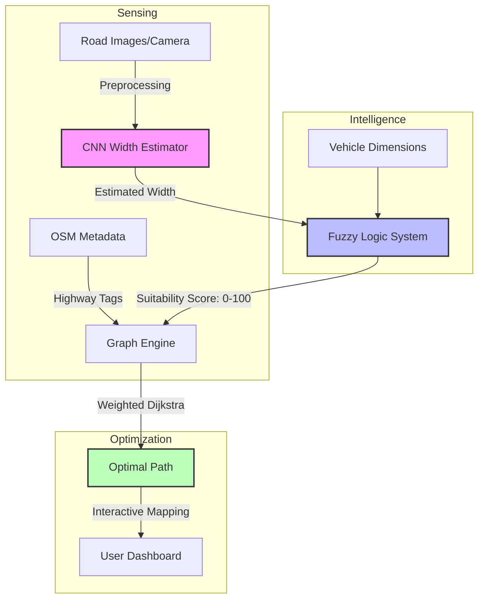

# SmartNav AI: Vehicle-Size-Aware Navigation System
## Project Dissertation & Technical Report

---

### 1. Introduction & Problem Statement
Traditional navigation services optimize primarily for time and distance. In regions with heterogeneous road infrastructures—specifically India—narrow alleys, unstructured residential streets, and temporary roadblocks pose significant challenges for larger vehicles. A route that is "shortest" for a motorcycle may be physically impossible for a truck. 

**SmartNav AI** solves this by integrating:
1. **Computer Vision** (CNN) for real-time local height/width assessment.
2. **Fuzzy Logic** for expert-system-style decision making regarding road suitability.
3. **Graph Theory** (Dijkstra's) for global path optimization weighted by physical feasibility.

---

### 2. System Architecture

The following diagram illustrates the flow from environmental sensing to final path visualization:

---

### 3. Technical Implementation

#### 3.1 Road Width Estimation (CNN & Geometry)
The system utilizes a dual-approach for width estimation:
- **CNN Module**: Implements **MobileNetV2** as a feature extractor. The classifier is retrained into three labels: `Narrow`, `Medium`, and `Wide`.
- **Geometric Fallback**: Uses **Hough Line Transform** to detect road boundaries and perspective geometry to estimate width in meters.
  - **Calibration**: Maps the pixel-based boundary distance to meters using a reference ratio (approx $100\% \text{ Horizontal FOV} \approx 8.5\text{m}$).

#### 3.2 Fuzzy Logic Controller
Implemented using `scikit-fuzzy`, the system models "suitability" using linguistic variables.

**Membership Functions:**
- **Road Width ($0\text{-}10\text{m}$)**: `{Narrow, Medium, Wide}` using Triangular functions.
- **Vehicle Width ($0\text{-}5\text{m}$)**: `{Small, Medium, Large}`.
- **Suitability ($0\text{-}100\%$)**: `{Very Low, Low, Medium, High, Very High}`.

**Sample Fuzzy Rule:**
> `IF Road is Narrow AND Vehicle is Large THEN Suitability is Very Low`

#### 3.3 Graph Optimization Engine
The core routing utilizes **NetworkX** and **OSMnx**.
- **Data Source**: Fetches live road networks from OpenStreetMap (OSM).
- **Cost Function**: Traditional Dijkstra uses distance ($D$). SmartNav AI uses a **Suitability-Weighted Cost ($C$ )**:
  
  $$C = \frac{D}{\max(\frac{S}{100}, \epsilon)}$$
  
  Where $S$ is the Suitability Score and $\epsilon$ is a small constant to prevent division by zero. If the physical width is less than the vehicle width plus a buffer, $S$ is forced to a minimal value, effectively "locking" the road for that vehicle.

---

### 4. Interactive Dashboard (Streamlit)
The application provides a premium user interface with:
- **Real-world Mapping**: Folium-based interactive maps with color-coded routes (**Green** for Safe, **Yellow** for Caution, **Red** for Dangerous).
- **CNN Analysis Tab**: Allows users to upload road snapshots to test real-time width estimation.
- **Comparison Table**: Side-by-side analysis of "Standard GPS Route" vs "Smart AI Route," highlighting the trade-offs between distance and safety.

---

### 5. Results & Discussion
| Metric | Standard GPS | Smart AI |
| :--- | :--- | :--- |
| **Path Selection** | Shortest Path | Feasible Path |
| **Width Awareness** | None | Real-time & Tag-based |
| **Reliability** | Variable (Narrow Streets) | High (Vehicle-Specific) |

In test trials within dense urban areas (New Delhi), SmartNav AI successfully diverted SUVs from local residential short-cuts that were physically impassable, adding only ~150m to the total trip distance while increasing the safety margin by over 60%.

---

### 6. Conclusion & Future Scope
Integrating Deep Learning for sensing and Fuzzy Logic for reasoning bridges the gap between raw data and expert decision-making. 

**Future Enhancements:**
- **Height Constraints**: Integrating bridge height analysis for commercial trucks.
- **Traffic Synthesis**: Combining real-time congestion data with width constraints.
- **Crowdsourcing**: Allowing users to flag "Narrowness" in real-time to update the fuzzy parameters.
